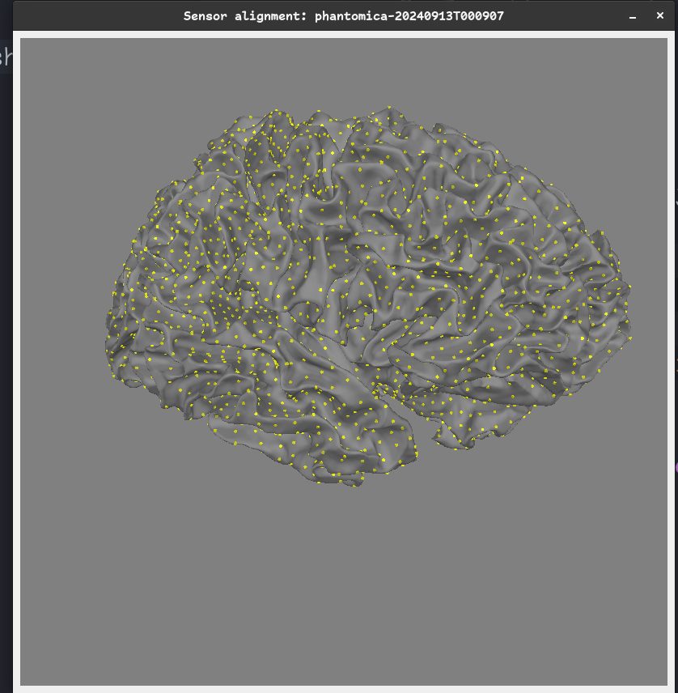
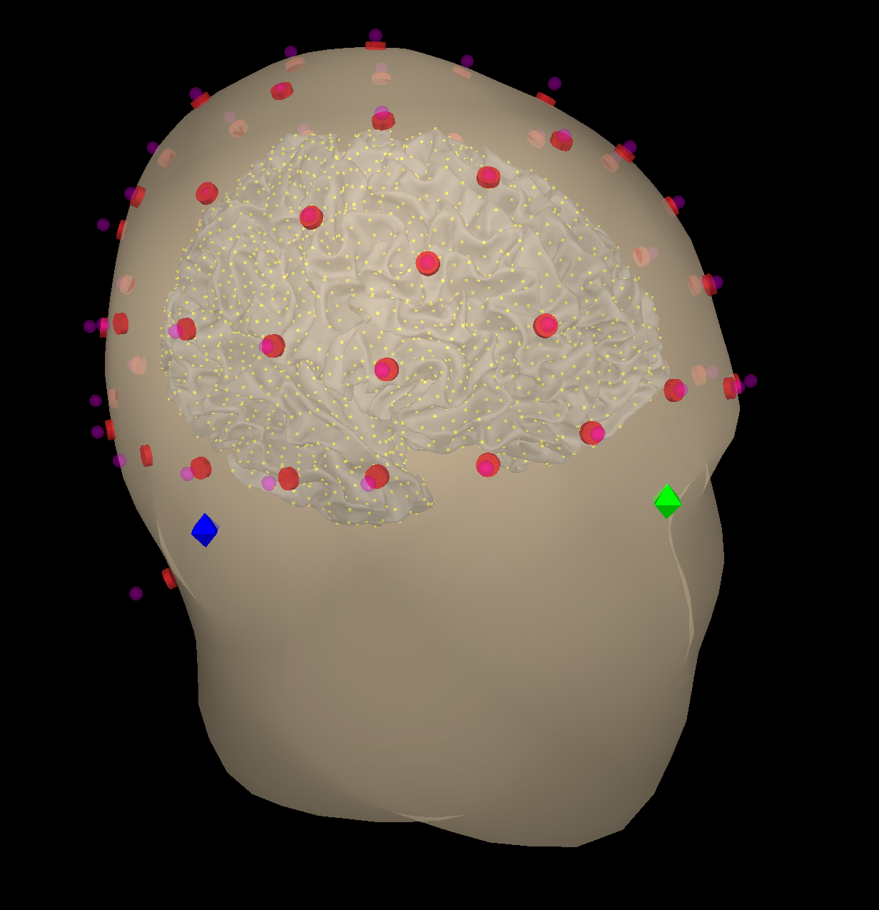

===
gte
===

.. image:: https://img.shields.io/pypi/v/gte.svg
        :target: https://pypi.python.org/pypi/gte

.. image:: https://readthedocs.org/projects/gte/badge/?version=latest
        :target: https://gte.readthedocs.io/en/latest/?version=latest
        :alt: Documentation Status

gte: ground truth establisher

* Free software: GNU General Public License v3
* Documentation: https://gte.readthedocs.io.
* Source: https://github.com/cogsys-io/gte.

Features
--------

Credits
-------

This package was created with Cookiecutter_ and the `cogsys-io/cogsys-io-cookiecutter-pypackage`_ project template.

.. _Cookiecutter: https://github.com/cookiecutter/cookiecutter
.. _`cogsys-io/cogsys-io-cookiecutter-pypackage`: https://github.com/cogsys-io/cogsys-io-cookiecutter-pypackage
